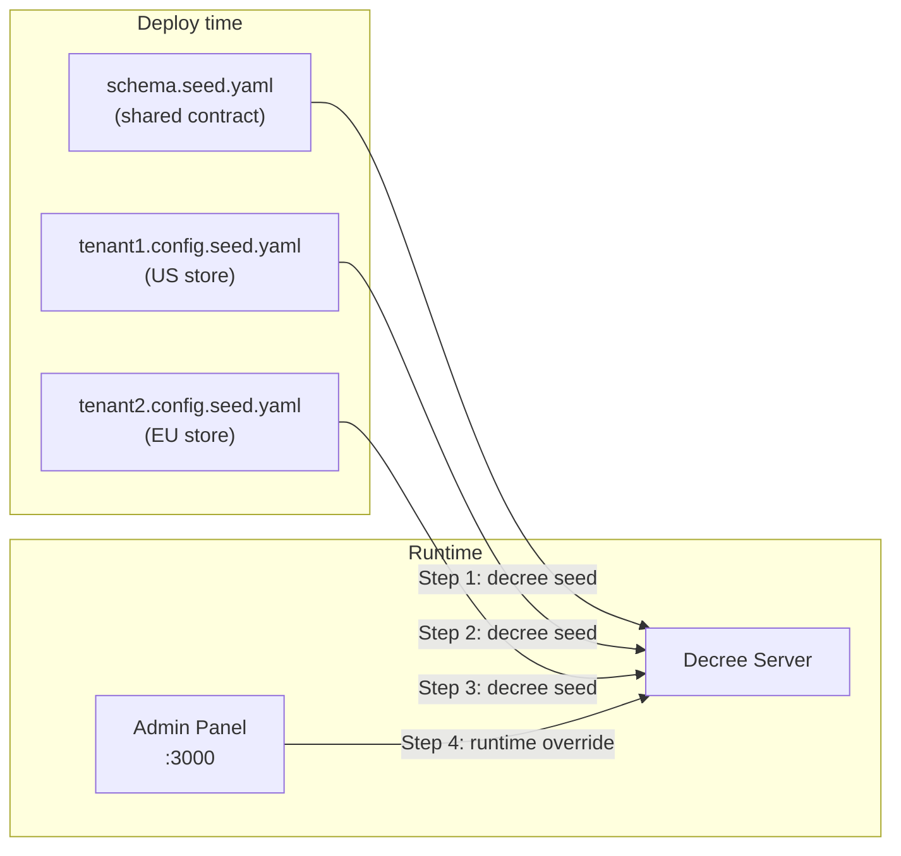

# Multi-Tenant with Shared Schema

[](https://codespaces.new/opendecree/demos?devcontainer_path=.devcontainer%2Fmulti-tenant%2Fdevcontainer.json)

> Multiple customers share one schema definition but manage their config values completely independently.

## What you'll learn

This tutorial shows how OpenDecree handles the core SaaS multi-tenancy pattern:

- The **schema** is the contract — it belongs to the engineering team and ships with the application.
- Each **tenant** (customer) provisions their own config values against that schema independently.
- Changing one tenant's config has zero effect on any other tenant.
- All tenants are validated against the same schema — constraints are enforced for everyone.

This demo uses a SaaS e-commerce platform as the example: two stores (one US, one EU) that run on the same platform with different currencies, tax rates, and tier limits.

## Prerequisites

- Docker and Docker Compose
- `curl` (for the CLI steps)

## Quick start

```bash
./run.sh
```

Then open:
- **[http://localhost:3000](http://localhost:3000)** — Admin panel (switch between tenant1 and tenant2)
- **[http://localhost:8080](http://localhost:8080)** — Decree REST API

## Step-by-step walkthrough

### Step 1 — App deploys the schema

The schema is a deployment artifact. The engineering team publishes it once per release — independently of any tenant or config values.

```bash
docker compose run --rm seed-schema
```

`schema.seed.yaml` defines five fields across three groups:

| Field | Type | Constraint |
|-------|------|------------|
| `checkout.currency` | string | enum: USD, EUR, GBP |
| `checkout.tax_rate` | number | 0 – 0.5 |
| `notifications.email_enabled` | bool | — |
| `notifications.webhook_url` | url | — |
| `pricing.free_tier_limit` | integer | min: 0 |

No tenant data, no config values — just the field definitions and their constraints. Every tenant that onboards later will be validated against this contract.

**Why it matters:** When you ship a new feature that needs a new config field, you publish a new schema version. All tenants pick it up on their own schedule. Their config files don't change.

### Step 2 — Tenant 1 (US store) provisions its config

Tenant 1 is a US-based store. Their deployment pipeline seeds their config once and keeps it in version control.

```bash
docker compose run --rm seed-tenant1
```

`tenant1.config.seed.yaml` references the schema by name and sets values appropriate for a US store:

```yaml
checkout.currency: USD
checkout.tax_rate: 0.08        # 8% sales tax
notifications.email_enabled: true
notifications.webhook_url: https://hooks.tenant1.example.com/orders
pricing.free_tier_limit: 100
```

The file does not redeclare fields or constraints — those live in the schema. Tenant 1 only sets values.

**Why it matters:** Tenant 1's config is decoupled from the engineering team's release cycle. They can update their values independently, at their own pace, without touching the schema.

### Step 3 — Tenant 2 (EU store) onboards

Tenant 2 is a European store. They use the same platform (same schema), but different values.

```bash
docker compose run --rm seed-tenant2
```

`tenant2.config.seed.yaml` references the same `saas-ecommerce` schema but sets EU-appropriate values:

```yaml
checkout.currency: EUR
checkout.tax_rate: 0.20        # 20% VAT
notifications.email_enabled: true
notifications.webhook_url: https://hooks.tenant2.example.com/orders
pricing.free_tier_limit: 50
```

**Why it matters:** Adding the hundredth tenant is identical to adding the second. The schema is a shared contract; config is per-tenant state. No schema duplication, no per-tenant copies of field definitions.

### Step 4 — Verify isolation

Look up each tenant's ID (REST endpoints address tenants by UUID, not name):

```bash
curl -s http://localhost:8080/v1/tenants -H "x-subject: demo-user" | python3 -m json.tool
```

Note the `id` for `tenant1` and `tenant2`, then export them for the commands below:

```bash
export TENANT1_ID=<tenant1 id>
export TENANT2_ID=<tenant2 id>
```

Read both tenants and confirm their values are independent:

```bash
# Tenant 1 — US store
curl http://localhost:8080/v1/tenants/$TENANT1_ID/config -H "x-subject: demo-user"

# Tenant 2 — EU store
curl http://localhost:8080/v1/tenants/$TENANT2_ID/config -H "x-subject: demo-user"
```

Now change tenant 1's tax rate:

```bash
curl -X PUT http://localhost:8080/v1/tenants/$TENANT1_ID/config/fields/checkout.tax_rate \
  -H "Content-Type: application/json" \
  -H "x-subject: demo-user" \
  -d '{"value": {"numberValue": 0.10}, "description": "Runtime override demo"}'
```

Read both again — tenant 2 is untouched:

```bash
# tenant1 → 0.1 (updated)
curl http://localhost:8080/v1/tenants/$TENANT1_ID/config/fields/checkout.tax_rate -H "x-subject: demo-user"

# tenant2 → 0.2 (unchanged)
curl http://localhost:8080/v1/tenants/$TENANT2_ID/config/fields/checkout.tax_rate -H "x-subject: demo-user"
```

**Why it matters:** Config changes are scoped to a single tenant. There is no shared mutable state between tenants — even though they share a schema.

### Step 5 (optional) — Schema validation in action

Try setting an invalid value — the server rejects it:

```bash
# Attempt to set currency to an unsupported value (not in enum)
curl -X PUT http://localhost:8080/v1/tenants/$TENANT1_ID/config/fields/checkout.currency \
  -H "Content-Type: application/json" \
  -H "x-subject: demo-user" \
  -d '{"value": {"stringValue": "JPY"}}'
# → 400 Bad Request: constraint violation
```

Both tenants are protected by the same schema constraints — neither can set a value outside the defined enum or range.

### Step 6 (optional) — Evolve the schema

Add a new field to `schema.seed.yaml`:

```yaml
checkout.express_enabled:
  type: bool
  description: Enable express checkout for this store
```

Re-seed the schema — the new field appears for both tenants immediately:

```bash
docker compose run --rm seed-schema
```

Neither tenant's existing config values are affected. The new field is available to both, ready to be configured.

## What's happening



The schema is seeded once. Each tenant seeds their config independently, referencing the schema by name. The Decree server validates every write against the schema constraints — for every tenant.

## Clean up

```bash
docker compose down -v
```

## Appendix: Environment and Architecture

<details>
<summary>Click to expand</summary>

### Services

| Service | Image | Ports | Purpose |
|---------|-------|-------|---------|
| postgres | `postgres:17` | (internal) | Schema, config, and audit storage |
| redis | `redis:7` | (internal) | Cache invalidation + real-time pub/sub |
| decree-server | `ghcr.io/opendecree/decree:0.12.0-alpha.3` | 8080 | Core config management |
| seed-schema | `ghcr.io/opendecree/decree-cli:0.12.0-alpha.3` | — | Step 1: imports saas-ecommerce schema |
| seed-tenant1 | `ghcr.io/opendecree/decree-cli:0.12.0-alpha.3` | — | Step 2: provisions tenant1 config |
| seed-tenant2 | `ghcr.io/opendecree/decree-cli:0.12.0-alpha.3` | — | Step 3: provisions tenant2 config |
| admin | `ghcr.io/opendecree/decree-ui:0.2.0-alpha.1` | 3000 | Admin GUI (multi-tenant mode) |

### Seed files

| File | Type | Purpose |
|------|------|---------|
| `schema.seed.yaml` | schema | Defines all fields and constraints — shared by all tenants |
| `tenant1.config.seed.yaml` | config | US store values |
| `tenant2.config.seed.yaml` | config | EU store values |

### Key design points

- The schema has no `tenant` section — it is owned by the application, not by any customer.
- Each config file has a `tenant` section but no `schema` section — it references, never redefines.
- `schema_version` is omitted in config files — binds to the latest published version automatically.
- Seeds are idempotent — re-running them does not create duplicate versions or overwrite runtime overrides.

### Volumes

| Volume | Purpose |
|--------|---------|
| `pgdata` | Persistent Postgres data (survives `docker compose stop`) |

</details>

## Next steps

- [Quickstart](../quickstart/) — see config changes flow to a live service in real time
- [REST Walkthrough](../rest-walkthrough/) — drive the same API with nothing but curl
- [OpenDecree docs](https://github.com/opendecree/decree) — full API, CLI, and SDK reference
