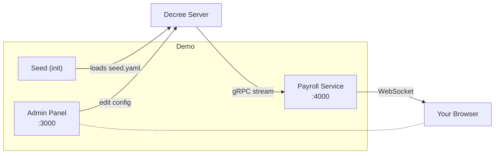

# Quickstart: Payroll Service

> A fintech microservice that reads its configuration from OpenDecree — with a live dashboard that updates in real time.

## What you'll learn

- How a service reads typed config values via the Go SDK
- How config changes propagate instantly via WebSocket (no polling, no restarts)
- How the admin panel lets non-technical users manage config without touching code
- How schema files ship with your deployment and seed automatically on startup

## Prerequisites

- Docker and Docker Compose

## Run it

```bash
docker compose up --build
```

Then open:
- **[http://localhost:4000](http://localhost:4000)** — Payroll Service dashboard
- **[http://localhost:3000](http://localhost:3000)** — Admin panel

## What's happening



1. **Seed container** loads `seed.yaml` (schema + tenant + initial config) on startup
2. **Payroll Service** connects to Decree via gRPC, reads config values, and serves a dashboard
3. **Admin panel** (decree-ui) lets you edit config values in a browser

The Payroll Service uses two SDK patterns:
- **configclient** — on-demand reads (the "Fetch" buttons)
- **configwatcher** — live subscription (the auto-updating values)

When you change a value in the admin panel, it flows: Admin → Decree Server → Redis pub/sub → gRPC stream → configwatcher → WebSocket → Dashboard. No restart needed.

## Try it yourself

### Change a config value

1. Open the [Admin panel](http://localhost:3000)
2. Find `payroll.tax_rate` and change it from `0.025` to `0.1`
3. Watch the dashboard — Tax Rate updates instantly from 2.5% to 10.0%

### Use the CLI

```bash
# List current config (use tenant name — no UUID needed)
docker compose exec seed decree config get-all demo-company \
  --server decree-server:9090 --subject demo

# Change processing fee via CLI
docker compose exec seed decree config set demo-company \
  payroll.processing_fee 0.99 \
  --server decree-server:9090 --subject demo
```

### Evolve the schema

This is the powerful part — edit `seed.yaml` and re-seed to evolve your schema:

1. Open `seed.yaml` and add a new field:
   ```yaml
   payroll.bonus_rate:
     type: number
     description: Annual bonus rate
     constraints:
       minimum: 0
       maximum: 1
   ```

2. Re-seed:
   ```bash
   docker compose run --rm seed
   ```

3. Check the admin panel — the new field appears, ready for configuration

Try also:
- **Add constraints** — make `payroll.period_days` have `maximum: 90` and see validation kick in
- **Change an enum** — add `"CHF"` to `payroll.currency` enum options

The seed is idempotent — existing values are preserved, new fields are added.

## Clean up

```bash
docker compose down -v
```

## Appendix: Environment and Architecture

<details>
<summary>Click to expand — useful for DevOps and platform engineers</summary>

### Services

| Service | Image | Ports | Purpose |
|---------|-------|-------|---------|
| postgres | `postgres:17` | (internal) | Schema, config, and audit storage |
| redis | `redis:7` | (internal) | Cache invalidation + real-time pub/sub |
| decree-server | `ghcr.io/opendecree/decree:main` | 9090 (gRPC), 8080 (REST) | Core config management |
| seed | `ghcr.io/opendecree/decree-cli:main` | — | Init container: loads schema from file |
| admin | `ghcr.io/opendecree/decree-ui:main` | 3000 | Admin GUI (nginx + React SPA) |
| payroll-service | Built from `./service` | 4000 | Demo app (Go + WebSocket) |

### Decree Server Environment Variables

| Variable | Value | Purpose |
|----------|-------|---------|
| `GRPC_PORT` | 9090 | SDK and CLI connections |
| `HTTP_PORT` | 8080 | REST API + Admin UI proxy target |
| `DB_WRITE_URL` | postgres://... | Primary database connection |
| `DB_READ_URL` | postgres://... | Read replica (same as write in demo) |
| `REDIS_URL` | redis://redis:6379 | Cache + pub/sub |
| `ENABLE_SERVICES` | schema,config,audit | Which gRPC services to enable |

### Admin UI Environment Variables

| Variable | Value | Purpose |
|----------|-------|---------|
| `API_URL` | http://decree-server:8080 | Backend API (proxied by nginx) |
| `LAYOUT_MODE` | single-tenant | Hides schema/tenant navigation |
| `TENANT_ID` | demo-company | Pre-selected tenant (slug or UUID) |
| `SCHEMA_ID` | (optional) | Pre-select a specific schema |
| `DEFAULT_ROLE` | admin | Default auth role (admin, not superadmin) |
| `DEFAULT_SUBJECT` | admin | Default auth identity |
| `BROWSER_API_URL` | (empty) | Browser API URL (empty = same-origin proxy) |

### Data Flow

```
seed.yaml → decree seed CLI → decree-server (Postgres)
                                    ↓
                              Redis pub/sub
                                    ↓
                        gRPC Subscribe stream
                                    ↓
                     payroll-service (configwatcher)
                                    ↓
                            WebSocket broadcast
                                    ↓
                          Browser dashboard
```

### Volumes

| Volume | Purpose |
|--------|---------|
| `pgdata` | Persistent Postgres data (survives `docker compose stop`) |
| `seed-data` | Passes tenant ID from seed container to payroll-service |

Use `docker compose down -v` to destroy all data and start fresh.

</details>

## Next steps

- [No SDK demo](../rest-walkthrough/) — drive the same API with curl (no Go needed)
- [Multi-Tenant demo](../multi-tenant/) — same schema, different tenants
- [OpenDecree docs](https://github.com/opendecree/decree) — full API, CLI, and SDK reference
- [Go SDK](https://pkg.go.dev/github.com/opendecree/decree/sdk/configclient) — configclient, configwatcher, adminclient
