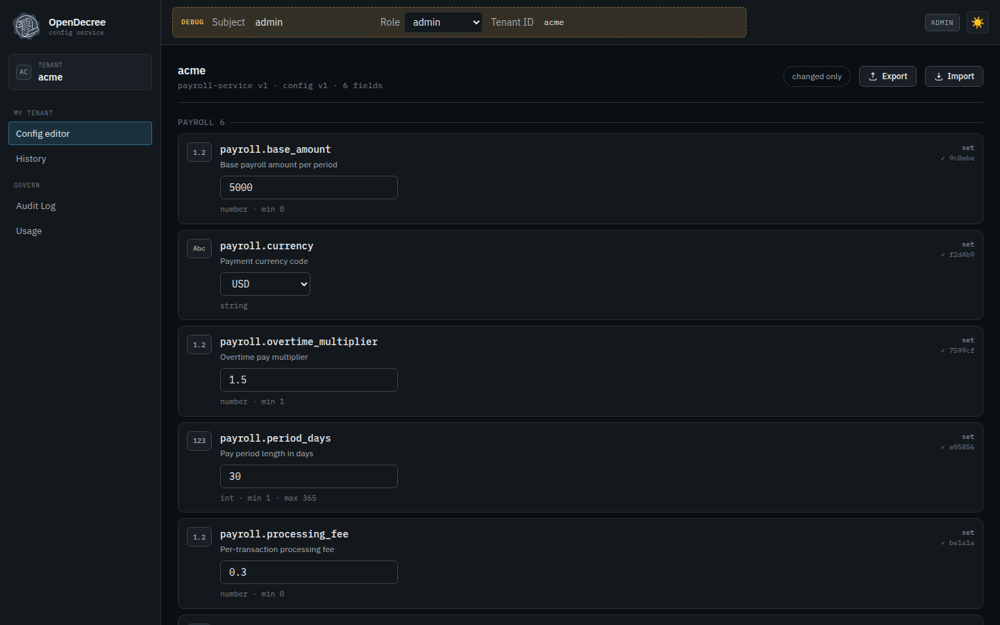
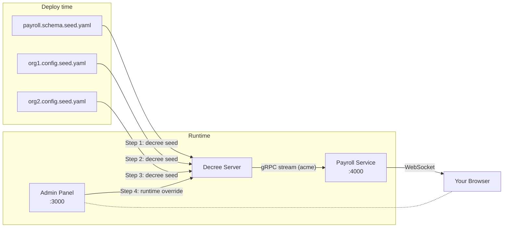

# Quickstart: Payroll Service

[](https://codespaces.new/opendecree/demos?devcontainer_path=.devcontainer%2Fquickstart%2Fdevcontainer.json)

> A fintech microservice that reads its configuration from OpenDecree — with a live dashboard that updates in real time.

## What you'll learn

This tutorial shows one of OpenDecree's core ideas: **schema and config have different deployment lifecycles**.

- The schema ships with the application — it's owned by the engineering team and deployed with the service.
- Each tenant provisions its own config independently — against the published schema, without touching the schema definition.

This separation lets N tenants share one schema while keeping their config values completely independent.

## Prerequisites

- Docker and Docker Compose
- (Optional) the `decree` CLI for step-by-step exploration

## Quick start (copy-paste)

```bash
./run.sh
```

Then open:
- **[http://localhost:4000](http://localhost:4000)** — Payroll Service dashboard
- **[http://localhost:3000](http://localhost:3000)** — Admin panel

The admin panel opens straight on acme's config editor — the role-first UI lands
each user on their primary task, and `admin` on a single pinned tenant goes right
to its config. Every field is one row with a type-aware input:



## Step-by-step walkthrough

The same four steps `run.sh` executes, explained in detail.

### Step 1 — App deploys the schema

The schema is a deployment artifact. It ships with the application and is published once per release — independently of any tenant or config values.

```bash
decree seed payroll.schema.seed.yaml --auto-publish
```

`payroll.schema.seed.yaml` contains only a `schema` section — no `tenant`, no `config`. This is intentional: the application team owns the schema definition; tenants have no role in it.

**Why it matters:** When you upgrade the application, you publish a new schema version. Tenants can migrate to it on their own schedule. Their config files don't change — only the `schema_version` binding changes.

### Step 2 — First tenant (`acme`) provisions its config

Acme Corp's deployment pipeline seeds its own config. The file references the schema by name — it does not redeclare fields or constraints.

```bash
decree seed org1.config.seed.yaml
```

`org1.config.seed.yaml` has a `tenant` section (with `schema: payroll-service`) and a `config` section. The `schema_version` field is omitted, which means it binds to whatever version is currently published — the pipeline doesn't need to track schema versions manually.

**Why it matters:** Acme's pipeline is decoupled from the engineering team's release cycle. When a new schema version is published, Acme re-seeds to pick it up — or pins a specific version if they need more time.

### Step 3 — Second tenant (`globex`) onboards

Globex Corp is a new customer. Their team copies `org1.config.seed.yaml`, edits a few values, and seeds their own config.

```bash
# Edit org2.config.seed.yaml: change currency to EUR, period_days to 14, etc.
decree seed org2.config.seed.yaml
```

Two tenants, one schema, independent config. The schema is not duplicated — Globex references the same `payroll-service` schema that Acme uses.

**Why it matters:** Adding the hundredth tenant is identical to adding the second. The schema is a shared contract; config is per-tenant state.

### Step 4 (optional) — Runtime override on top of the git baseline

The seeded config is the git baseline — config-as-code. But you can layer runtime overrides on top without touching the seed file:

```bash
decree config set acme payroll.tax_rate 0.22 --server localhost:9090 --subject admin
```

Watch the Payroll Service dashboard — the tax rate updates instantly via gRPC stream, no restart needed.

**Why it matters:** The seed file captures the stable baseline (reviewed, committed, audited). Operators apply short-lived overrides on top — without breaking the git workflow or requiring a redeployment.

## What's happening



The Payroll Service uses two SDK patterns:
- **configclient** — on-demand reads (the "Fetch" buttons)
- **configwatcher** — live subscription (the auto-updating values)

When you change a value in the admin panel (or via CLI), it flows: Admin → Decree Server → Redis pub/sub → gRPC stream → configwatcher → WebSocket → Dashboard. No restart needed.

## Try it yourself

### Change a config value via admin panel

1. Open the [Admin panel](http://localhost:3000) — `admin` lands directly on acme's config editor
2. Find the `payroll.tax_rate` field, change its value from `0.025` to `0.1`, and save
3. Watch the dashboard — Tax Rate updates instantly from 2.5% to 10.0%, no restart needed

### Use the CLI

```bash
# List acme's current config
docker compose run --rm seed-acme config get-all acme \
  --server decree-server:9090 --subject demo

# Apply a runtime override on top of the seeded baseline
docker compose run --rm seed-acme config set acme \
  payroll.processing_fee 0.99 \
  --server decree-server:9090 --subject demo

# Check globex's config (different values, same schema)
docker compose run --rm seed-globex config get-all globex \
  --server decree-server:9090 --subject demo
```

### Evolve the schema

Edit `payroll.schema.seed.yaml` and re-seed to publish a new schema version:

1. Add a new field:
   ```yaml
   payroll.bonus_rate:
     type: number
     description: Annual bonus rate
     constraints:
       minimum: 0
       maximum: 1
   ```

2. Re-seed the schema:
   ```bash
   docker compose run --rm seed-schema
   ```

3. Check the admin panel — the new field appears for both acme and globex, ready for configuration.

The seed is idempotent — existing values are preserved, new fields are added, schema version increments only when fields change.

## Clean up

```bash
docker compose down -v
```

## Appendix: Environment and Architecture

<details>
<summary>Click to expand — useful for DevOps and platform engineers</summary>

### Services

| Service | Image | Ports | Purpose |
|---------|-------|-------|---------|
| postgres | `postgres:17` | (internal) | Schema, config, and audit storage |
| redis | `redis:7` | (internal) | Cache invalidation + real-time pub/sub |
| migrate | `ghcr.io/opendecree/decree-cli:0.12.0-alpha.4` | — | Runs DB migrations (creates the `decree_app` role), then exits |
| decree-server | `ghcr.io/opendecree/decree:0.12.0-alpha.4` | (internal) | Core config management |
| seed-schema | `ghcr.io/opendecree/decree-cli:0.12.0-alpha.4` | — | Step 1: imports payroll schema |
| seed-acme | `ghcr.io/opendecree/decree-cli:0.12.0-alpha.4` | — | Step 2: provisions acme config |
| seed-globex | `ghcr.io/opendecree/decree-cli:0.12.0-alpha.4` | — | Step 3: provisions globex config |
| admin | `ghcr.io/opendecree/decree-ui:0.2.0-alpha.1` | 3000 | Admin GUI (nginx + React SPA) |
| payroll-service | Built from `./service` | 4000 | Demo app (Go + WebSocket) |

### Decree Server Environment Variables

| Variable | Value | Purpose |
|----------|-------|---------|
| `GRPC_PORT` | 9090 | SDK and CLI connections |
| `HTTP_PORT` | 8080 | REST API + Admin UI proxy target |
| `DB_WRITE_URL` | postgres://... | Primary database connection |
| `DB_READ_URL` | postgres://... | Read replica (same as write in demo) |
| `REDIS_URL` | redis://redis:6379 | Cache + pub/sub |
| `ENABLE_SERVICES` | schema,config,audit | Which gRPC services to enable |

### Admin UI Environment Variables

| Variable | Value | Purpose |
|----------|-------|---------|
| `API_URL` | http://decree-server:8080 | Backend API (proxied by nginx) |
| `LAYOUT_MODE` | single-tenant | Pin to one tenant; drop the tenant picker |
| `TENANT_ID` | acme | Pre-selected tenant (slug or UUID) |
| `SCHEMA_ID` | (optional) | Pre-select a specific schema |
| `DEFAULT_ROLE` | admin | Auth role; `admin` lands on the config editor (not superadmin) |
| `DEFAULT_SUBJECT` | admin | Default auth identity |
| `BROWSER_API_URL` | (empty) | Browser API URL (empty = same-origin proxy) |
| `LOGO_URL` | (empty) | Custom logo URL (empty = OpenDecree logo) |
| `APP_NAME` | (empty) | Custom app name (empty = "OpenDecree") |

### Data Flow

```
payroll.schema.seed.yaml → decree seed CLI → decree-server (Postgres)
org1.config.seed.yaml   → decree seed CLI ↗
org2.config.seed.yaml   → decree seed CLI ↗
                                    ↓
                              Redis pub/sub
                                    ↓
                        gRPC Subscribe stream (acme tenant)
                                    ↓
                     payroll-service (configwatcher)
                                    ↓
                            WebSocket broadcast
                                    ↓
                          Browser dashboard
```

### Volumes

| Volume | Purpose |
|--------|---------|
| `pgdata` | Persistent Postgres data (survives `docker compose stop`) |

Use `docker compose down -v` to destroy all data and start fresh.

</details>

## Next steps

- [No SDK demo](../rest-walkthrough/) — drive the same API with curl (no Go needed)
- [OpenDecree docs](https://github.com/opendecree/decree) — full API, CLI, and SDK reference
- [Go SDK](https://pkg.go.dev/github.com/opendecree/decree/sdk/configclient) — configclient, configwatcher, adminclient
